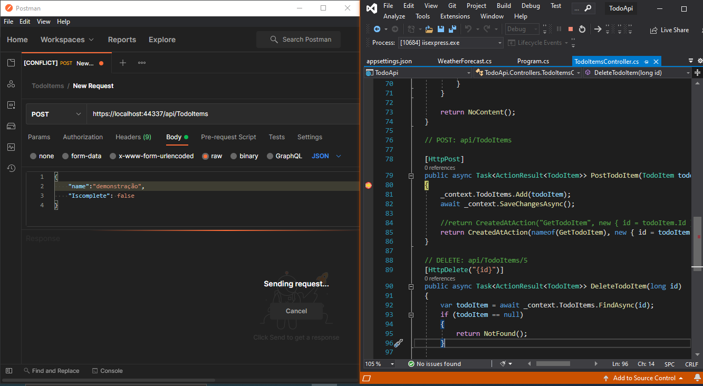
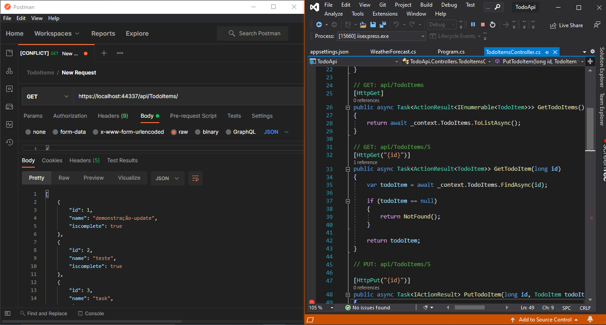
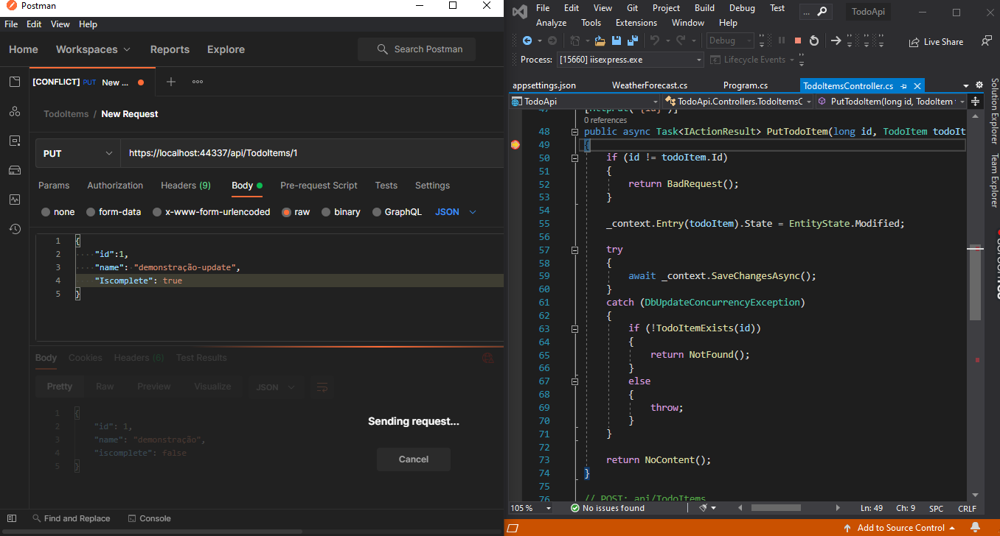
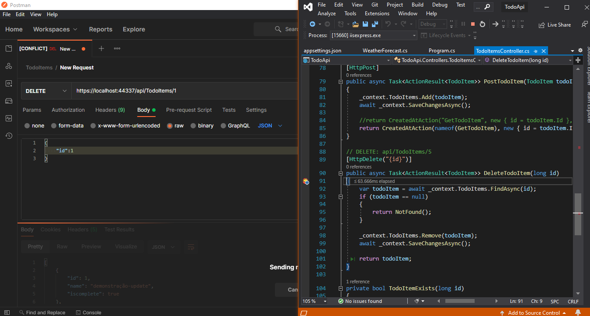

<h1>Api <strong>ToDo</strong> com dotnet</h1>

### Api desenvolvida para fixar conceitos e aprender cada vez mais.

#### primeira Api que criei.

## Rodar a Api
* Certifique-se de ter o dotnet instalado em sua máquina;
* Clone o Repositório;
* Abra o projeto em um editor de código de sua preferência e execute.

## Exemplos de requisições

### Criar

### Listar

### Atualizar

### Deletar

 

### by Luan Santos
